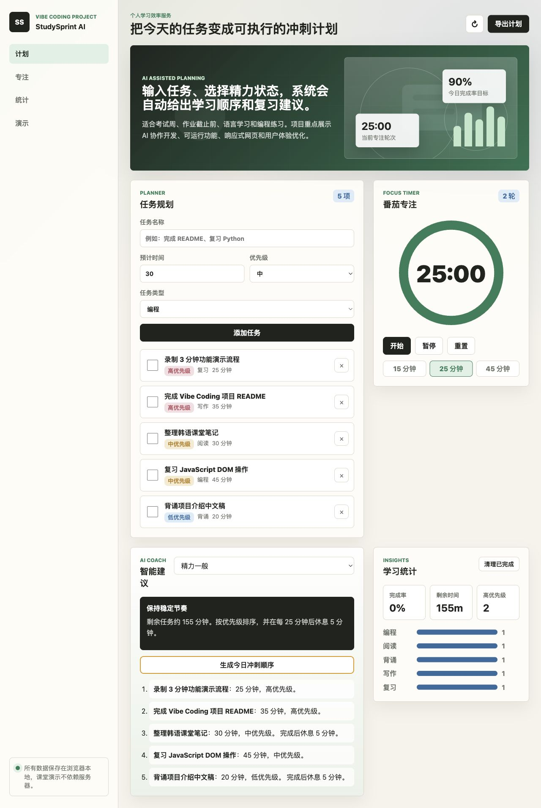
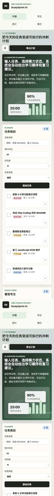

# StudySprint AI

StudySprint AI 是一个面向学生的学习冲刺规划器。用户可以添加学习任务，设置预计时间、优先级和任务类型，应用会根据当前精力状态生成今日学习顺序，并提供番茄钟、任务统计和本地保存功能。

## 项目介绍

本项目是“Vibe Coding 个人项目”作业作品，目标是用生成式 AI 协作完成一个可以实际运行、可以现场演示、可以上传到 GitHub 的轻量级 Web 服务。

项目场景：考试周或作业截止前，学生经常不知道应该先做什么。StudySprint AI 将任务拆分成可执行的学习冲刺，帮助用户更清楚地安排时间。

## 主要功能

- 任务管理：添加、完成、删除学习任务。
- 优先级规划：支持高、中、低优先级和不同学习类型。
- AI 风格建议：根据任务优先级、预计时间和当前精力状态生成学习建议。
- 今日冲刺顺序：一键生成推荐执行顺序。
- 番茄专注计时器：支持 15、25、45 分钟专注模式。
- 学习统计：显示完成率、剩余时间、高优先级任务数量和类型分布图。
- 本地保存：使用 `localStorage` 保存数据，刷新页面后仍能保留。
- 响应式设计：适配桌面端和手机端浏览。

## 使用的 AI 工具

- OpenAI ChatGPT / Codex：协助项目创意设计、页面结构规划、前端代码实现、README 编写和调试。
- AI 协作方式：先确定作业评分点，再由 AI 生成初始方案，随后人工选择功能范围，并对界面、文案和演示流程进行调整。

## 技术栈

- HTML5
- CSS3
- JavaScript
- LocalStorage
- Git / GitHub

## 运行方法

方法一：直接打开文件

```bash
open index.html
```

方法二：使用本地服务器运行

```bash
python3 -m http.server 4173
```

然后在浏览器打开：

```text
http://localhost:4173
```

## 运行截图

桌面端：



移动端：



## 项目结构

```text
.
├── index.html
├── styles.css
├── app.js
├── assets/
│   └── study-grid.svg
├── screenshots/
│   ├── desktop.png
│   └── mobile.png
└── README.md
```

## 展示时可演示的流程

1. 点击右上角刷新按钮载入演示数据。
2. 添加一个新的学习任务，例如“准备课堂发表”。
3. 切换精力状态，点击“生成今日冲刺顺序”。
4. 勾选一个任务，观察完成率和剩余时间变化。
5. 展示番茄钟的开始、暂停、重置和时间预设。
6. 点击“导出计划”，说明可以复制今日计划。

## 开发过程中遇到的问题与解决方法

- 问题：如果项目依赖后端或外部 API，课堂演示可能因为网络问题失败。
  - 解决：采用纯前端实现，核心数据保存在浏览器本地，保证离线也能演示。
- 问题：任务多时页面容易混乱。
  - 解决：使用优先级标签、统计卡片和类型图表，让信息更容易扫描。
- 问题：手机端按钮和表单容易挤在一起。
  - 解决：使用响应式布局，在小屏幕下将表单、统计和导航改为单列。

## 后续改进方向

- 接入 OpenAI API，生成更自然的学习建议。
- 接入 Supabase，实现账号登录和云端同步。
- 使用 Vercel 部署，方便通过公开链接访问。
