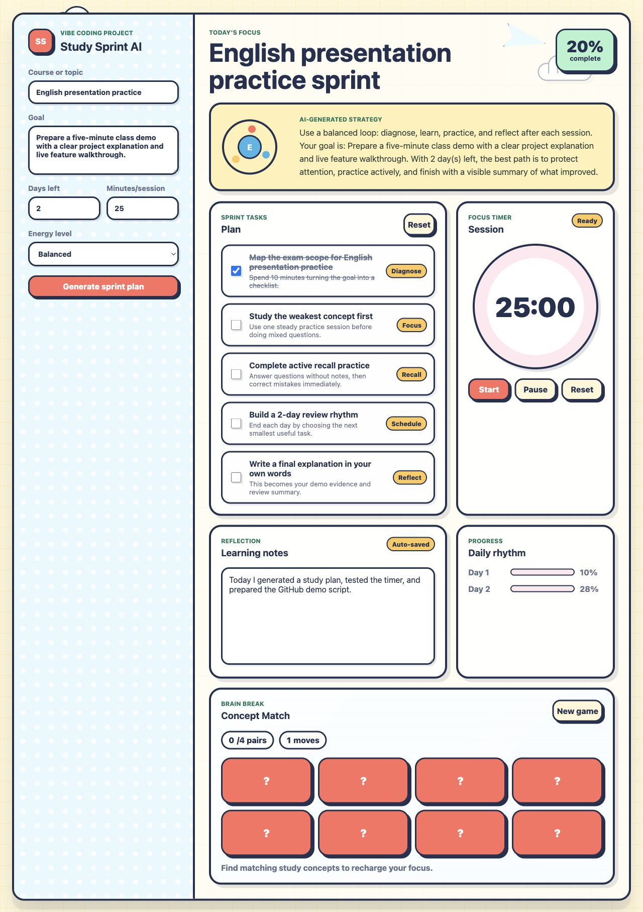

# Study Sprint AI

Study Sprint AI is an English web application for students who need to turn a study goal into a focused short-term action plan. The app was created as a Vibe Coding personal project with AI assistance.

## Project Introduction

The service helps a student enter a topic, goal, deadline, study session length, and energy level. It then generates a sprint plan with study tasks, a focus strategy, a timer, notes, and progress tracking.

This project focuses on practical learning support rather than project size. It is designed so the main features can be demonstrated live in class.

## Main Features

- AI-style study plan generator based on topic, goal, days left, session length, and energy level
- Interactive task checklist with completion percentage
- Focus timer for study sessions
- Daily progress visualization
- Auto-saved learning notes using browser local storage
- Cartoon-style study background and playful visual design
- Concept Match mini-game for a short brain break during study
- Responsive layout for desktop and mobile screens

## AI Tools Used

- OpenAI Codex / ChatGPT for project planning, code generation, debugging, and README writing
- AI-assisted Vibe Coding workflow: describe the desired service, generate an initial version, test it, then improve layout and functionality

## Tech Stack

- HTML
- CSS
- JavaScript
- Browser Local Storage
- Git and GitHub

## How to Run

Open `index.html` directly in a browser.

You can also run a local server:

```bash
python3 -m http.server 8000
```

Then open:

```text
http://localhost:8000
```

## Demo Guide

1. Enter a course or topic.
2. Write a learning goal.
3. Select days left, session length, and energy level.
4. Click **Generate sprint plan**.
5. Mark tasks as complete and show the progress percentage.
6. Start the focus timer.
7. Play the **Concept Match** mini-game by flipping cards and finding pairs.
8. Write notes and refresh the page to show that notes are saved.

## Screenshot



## Development Notes

During development, AI helped create the first version of the interface and logic. I reviewed the result, adjusted the project idea for a student-use case, improved the responsive layout, and added features that are easy to demonstrate: task progress, timer controls, and saved notes.
